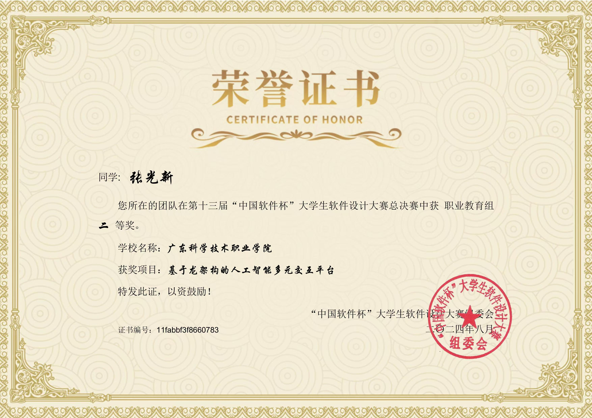
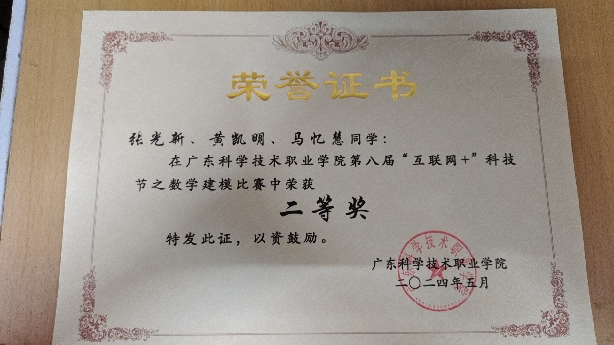
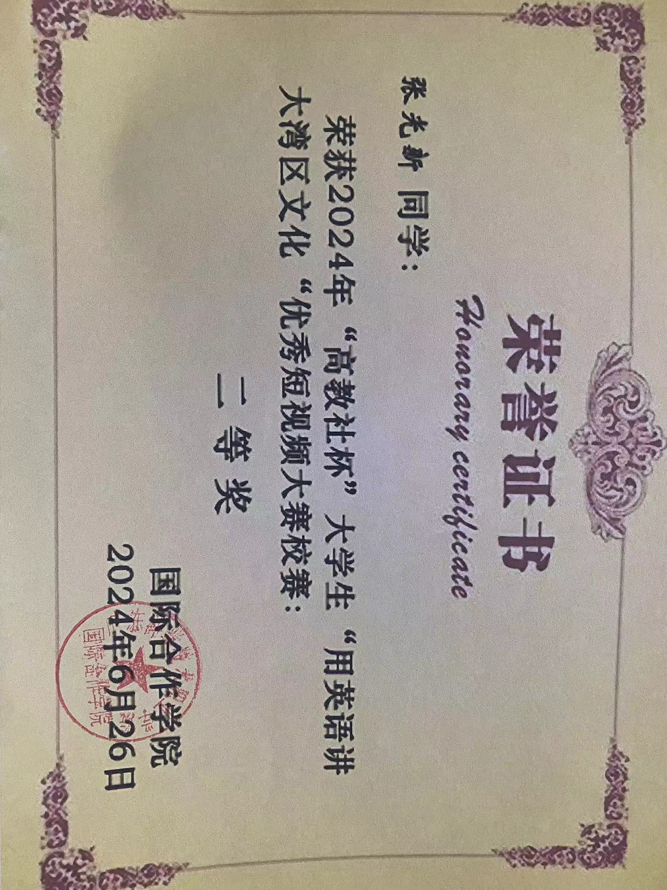
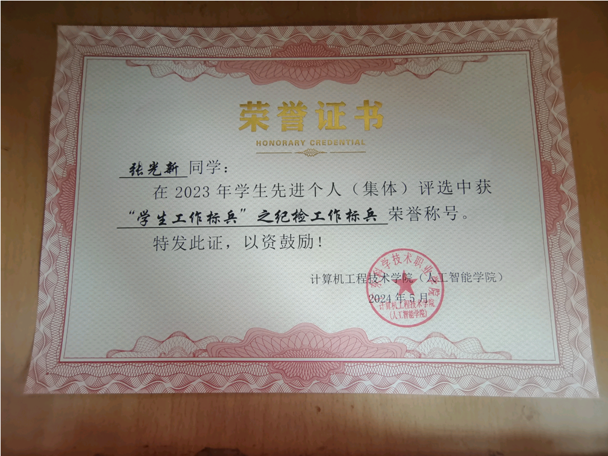
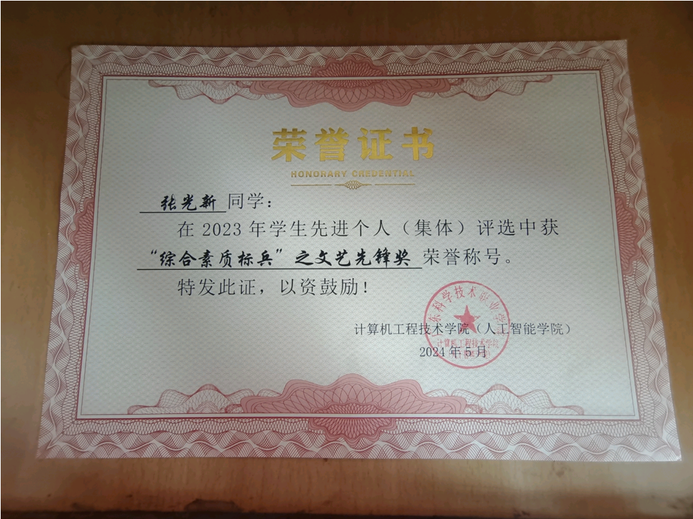
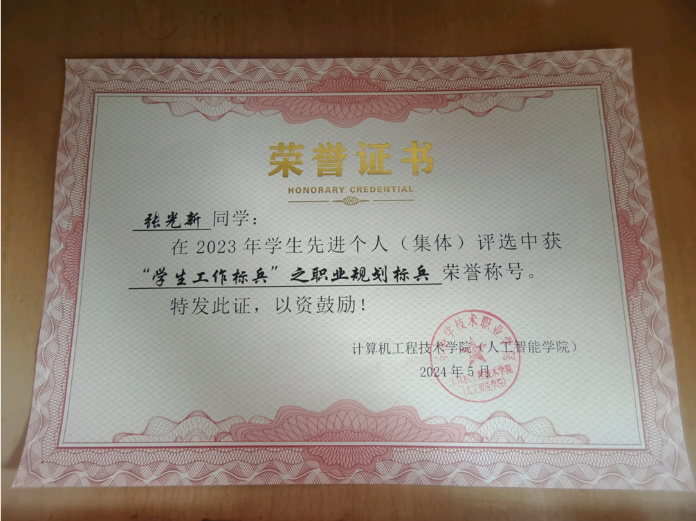
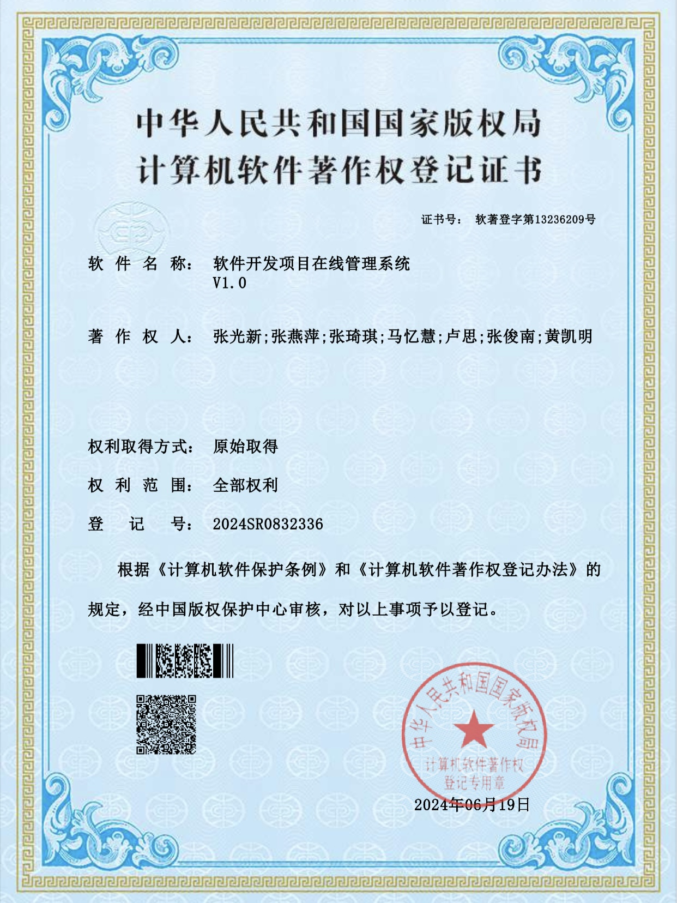

# 一类赛事
## 国家级

## 省级

## 省级以下
## 1
### 奖项名称：第十三届“中国软件杯”大学生软件设计大赛基于龙架构的人工智能多元交互平台全国总决赛二等奖
### 颁奖单位：中国软件杯”大学生软件设计大赛组委会

# 二类赛事
## 国家级

## 1
### 奖项名称：第十三届“中国软件杯”大学生软件设计大赛基于龙架构的人工智能多元交互平台全国总决赛二等奖
### 颁奖单位：中国软件杯”大学生软件设计大赛组委会
### 奖项图片 

## 省级
## 1

## 省级以下
## 1
### 奖项名称：第八届“互联网+”科技节之数学建模大赛二等奖
### 颁奖单位：共青团广东科学技术职业学院委员会
### 奖项图片 
# 三类赛事
## 国家级
## 省级
## 1
### 奖项名称：
### 颁奖单位：
## 省级以下

# 其他赛事
## 1
### 奖项名称：“高教社杯”大学生“用英语讲大湾区文化“优秀短视频大赛校赛二等奖
### 颁奖单位：广东科学技术职业学院国际合作学院
### 奖项图片 
## 2
### 奖项名称：2023-2024学年度计算机工程技术学院(人工智能学院)“青春报国，复兴有我征文比赛 二等奖
### 颁奖单位：计算机工程技术学院（人工智能学院）
### 奖项图片 
# 其他奖项

### 2023-2024学年度学生奖励学金“学习之星”
### 2023-2024学年度学生奖励学金“学生干部之星”
### 2023-2024学年度学生奖励学金“综合素质之星”
### 2023-2024学年度学生奖励学金“科研之星”
### 2023-2024学年度学生奖励学金“技能之星”
### 2023年学生先进个人(集体)评选中获“学生工作标兵”之职业规划标兵荣誉
### 荣誉证书：
### 2023年学生先进个人(集体)评选中获“综合素质标兵”之文艺先锋奖荣誉
### 荣誉证书：
### 2023年学生先进个人(集体)评选中获“学生工作标兵”之职业规划标兵荣誉
### 荣誉证书：
# 软著
## 1
### 著作名称：软件开发项目在线管理系统V1.0软件著作
### 单位：中华人民共和国国家版权局
### 证书图片：
# 论文
## 1
### 论文名称：Blockchain-Based Prepackaged Food Supply Chain Management Platform
### 论文类型：EI
### 单位：第五届大数据、人工智能与物联网工程国际会议（ICBAIE 2024）AEIC学术交流中心
### 证书图片：